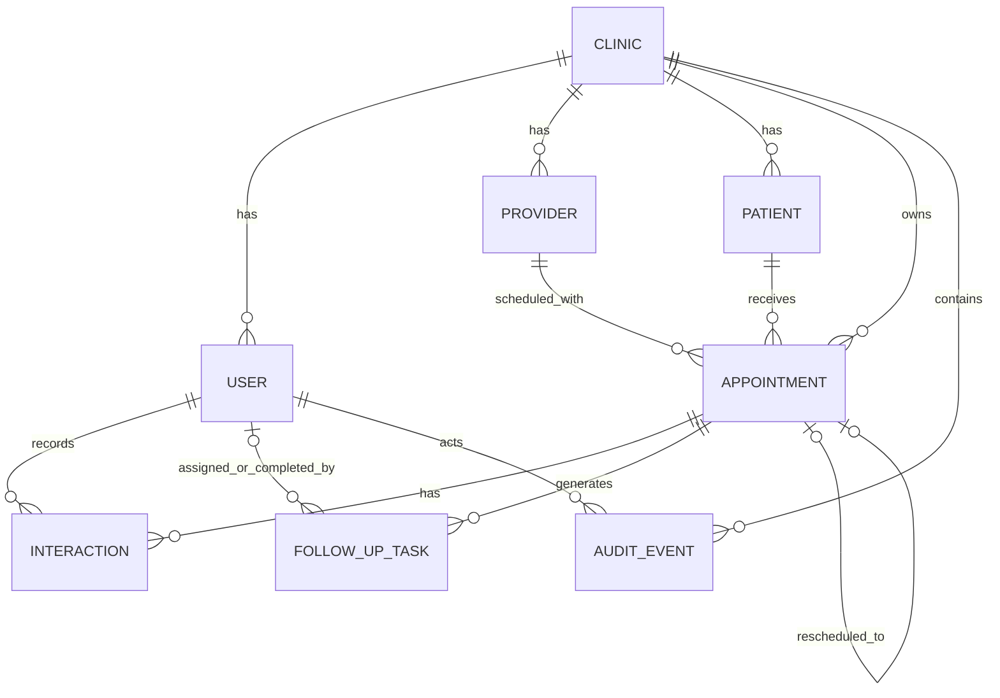

# CRM_ENTITY_RELATIONSHIPS.md — Dental Patient Follow-Up

> **Product boundary:** A focused CRM-lite system for **dental clinics and hospitals** that manages patient return appointments and follow-up continuity. It is not a traditional sales CRM, EMR/EHR, or full Hospital Management System (HMS).

> **Primary product reference:** *Patient Follow-Up App MVP Requirements*.

> **UX reference:** Zoho CRM Nextgen is used only for navigation and interaction patterns such as a unified/collapsible sidebar, a main work pane, global search/quick create, and contextual related-record history. Zoho's larger sales CRM feature set is intentionally excluded.

> **Notation:** **[ASSUMPTION]** marks a product/engineering decision introduced because the source requirements do not specify the detail.

## 1. Core Relationship Model

This is CRM-like because it preserves **relationship continuity**, but the objects are healthcare operational objects rather than sales objects.

```text
Clinic/Hospital
  ├─ Users
  ├─ Doctors/Dentists (Providers)
  └─ Patients
       └─ Return Appointments
            ├─ Follow-Up Task
            └─ Interactions / Call History
```

## 2. Entities

### Clinic
Tenant/organization boundary.

### User
Authenticated staff member.

### Provider
Dentist/doctor attached to an appointment.

**[ASSUMPTION]** Provider is separate from User because a clinician may be referenced without using the system directly.

### Patient
Minimal patient identity for follow-up.

### Appointment
Planned return visit.

### FollowUpTask
Current operational work required for an appointment.

### Interaction
Immutable/append-oriented record of a follow-up attempt and outcome.

### AuditEvent
Trace of material data changes.

## 3. ER Diagram



## 4. Relationship Rules

### Clinic → User
1:N. User belongs to one tenant in MVP.

### Clinic → Provider
1:N. Multiple dentists/doctors per clinic/hospital.

### Clinic → Patient
1:N. Patient record is tenant-scoped.

### Patient → Appointment
1:N. Patient can have multiple return visits over time.

### Provider → Appointment
1:N. Each appointment references one provider for MVP.

### Appointment → Interaction
1:N. Zero or many call/follow-up interactions.

### User → Interaction
1:N. Each interaction records the staff member who entered it.

### Appointment → FollowUpTask
1:N historically, but only one unresolved current follow-up task for the same appointment purpose.

### Appointment → Replacement Appointment
0..1 ↔ 0..1 for each link in a reschedule chain.

## 5. Patient Relationship View

```text
Arun Kumar
│
├─ Phone
├─ Current return appointment
│   ├─ Dr Kumar
│   ├─ 21 Aug · 3:00 PM
│   └─ Root canal review
│
└─ Timeline
    ├─ 18 Aug 10:34 — No answer — Nurse Anu
    ├─ 18 Aug 16:16 — Wants reschedule — Nurse Priya
    ├─ 18 Aug 16:18 — Old appointment superseded
    └─ 21 Aug 15:00 — New appointment
```

## 6. Entities Explicitly Excluded

Do not add:
- Lead
- Deal
- Opportunity
- Campaign
- Account/Company
- Marketing List
- Invoice
- Prescription
- Pharmacy Order
- Full Clinical Encounter

Those would turn a focused follow-up system into a different product.
