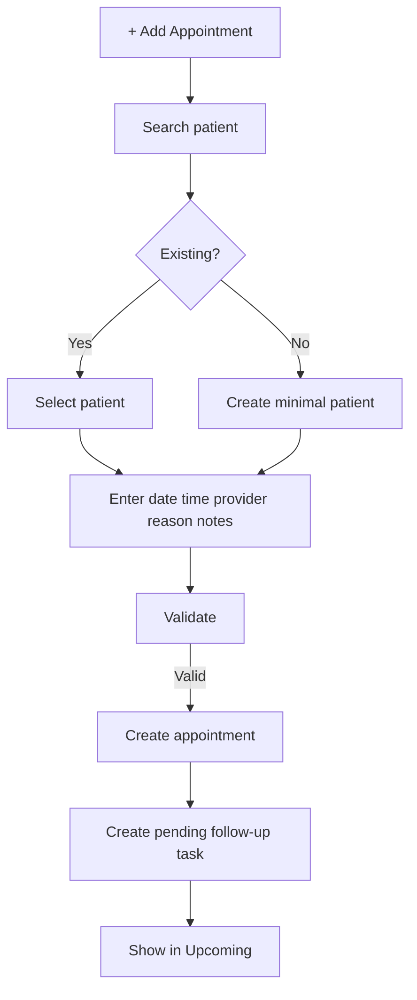
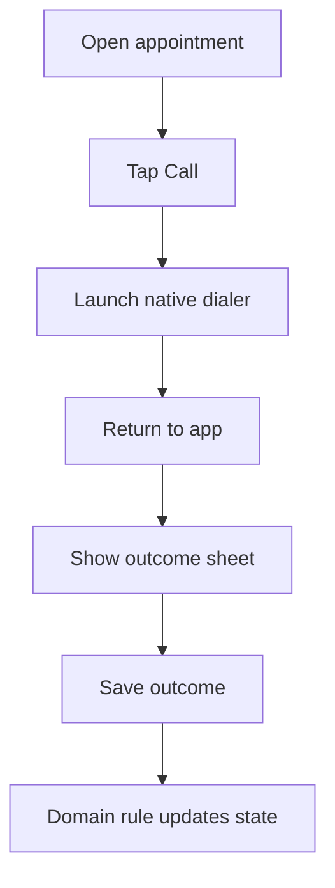
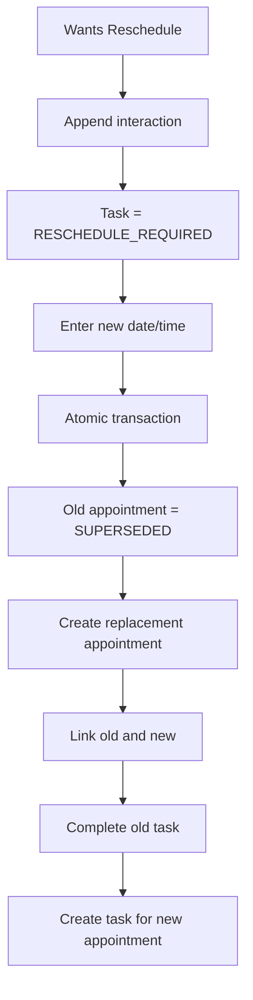
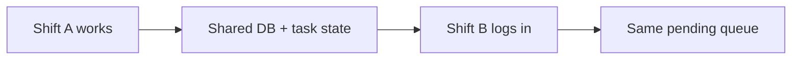

# CRM_WORKFLOWS.md — Dental Patient Follow-Up

> **Product boundary:** A focused CRM-lite system for **dental clinics and hospitals** that manages patient return appointments and follow-up continuity. It is not a traditional sales CRM, EMR/EHR, or full Hospital Management System (HMS).

> **Primary product reference:** *Patient Follow-Up App MVP Requirements*.

> **UX reference:** Zoho CRM Nextgen is used only for navigation and interaction patterns such as a unified/collapsible sidebar, a main work pane, global search/quick create, and contextual related-record history. Zoho's larger sales CRM feature set is intentionally excluded.

> **Notation:** **[ASSUMPTION]** marks a product/engineering decision introduced because the source requirements do not specify the detail.

## 1. Workflow Philosophy

The workflow is deterministic, not a generic CRM pipeline builder:

**Create → Contact → Record Outcome → Resolve / Retry / Reschedule**

## 2. Create Return Appointment



## 3. Mobile Call



**Technical limitation:** launching a dialer does not by itself guarantee reliable cross-platform call-end detection. MVP prompts after returning to the app.

## 4. Confirmed

```text
Record CONFIRMED
→ append interaction
→ appointment = CONFIRMED
→ follow-up task = COMPLETED
→ remove from Pending
→ retain appointment in upcoming schedule
```

## 5. No Answer / Busy / Disconnected

```text
Record outcome
→ append interaction
→ appointment remains active
→ task = RETRY
→ remains in Pending
```

## 6. Call Back Later

```text
CALL_BACK_LATER
→ optional retry time
→ append interaction
→ task = RETRY
→ retry_after set when provided
→ stay Pending
```

## 7. Reschedule



## 8. Cancelled

```text
CANCELLED
→ append interaction
→ appointment = CANCELLED
→ task closed
→ remove from active queues
→ retain history
```

## 9. Wrong Number

```text
WRONG_NUMBER
→ append interaction
→ patient phone status = INVALID
→ task = BLOCKED
→ show correction warning
→ authorized user updates number
→ task returns to PENDING
```

A wrong number must not automatically erase/cancel the appointment.

## 10. Other

**[ASSUMPTION]** Because `OTHER` cannot safely imply whether more work is required:

```text
Select OTHER
→ note required
→ ask “Follow-up still required?”
→ Yes = PENDING
→ No = COMPLETED
```

## 11. Shift Handover



No verbal handover should be required for basic follow-up.

## 12. Desktop Landline

```text
Open patient
→ read phone
→ call using landline
→ select outcome in browser
→ same backend workflow as mobile
```

## 13. Transition Table

| Event | Appointment | Task |
|---|---|---|
| New appointment | SCHEDULED | PENDING |
| Confirmed | CONFIRMED | COMPLETED |
| No answer | SCHEDULED | RETRY |
| Busy | SCHEDULED | RETRY |
| Disconnected | SCHEDULED | RETRY |
| Call later | SCHEDULED | RETRY |
| Wants reschedule | SCHEDULED | RESCHEDULE_REQUIRED |
| Reschedule saved | old SUPERSEDED, new SCHEDULED | old complete, new pending |
| Cancelled | CANCELLED | CANCELLED |
| Wrong number | SCHEDULED | BLOCKED |

## 14. Concurrency

**[ASSUMPTION]** Use optimistic concurrency with `row_version`.

If another staff member updates the same appointment first:
- server returns `409 CONFLICT`;
- client reloads current state;
- UI explains that the record changed.
