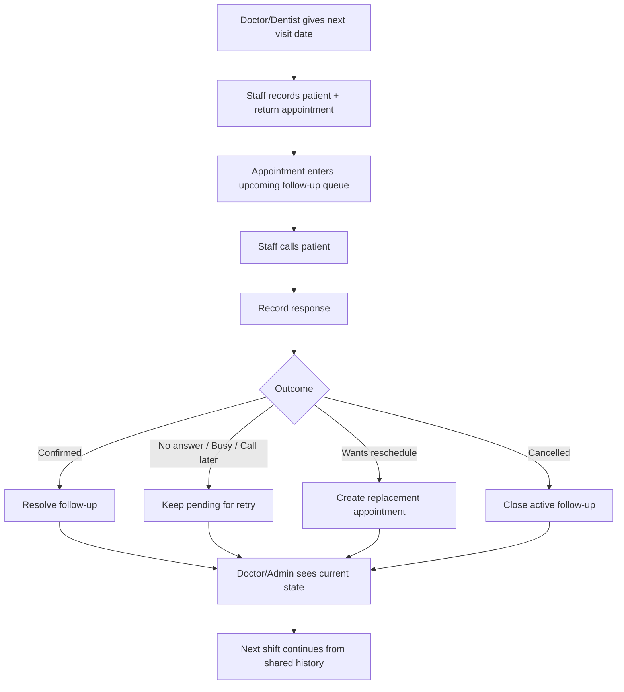

# PRD — Dental Clinic & Hospital Patient Follow-Up System

> **Product boundary:** A focused CRM-lite system for **dental clinics and hospitals** that manages patient return appointments and follow-up continuity. It is not a traditional sales CRM, EMR/EHR, or full Hospital Management System (HMS).

> **Primary product reference:** *Patient Follow-Up App MVP Requirements*.

> **UX reference:** Zoho CRM Nextgen is used only for navigation and interaction patterns such as a unified/collapsible sidebar, a main work pane, global search/quick create, and contextual related-record history. Zoho's larger sales CRM feature set is intentionally excluded.

> **Notation:** **[ASSUMPTION]** marks a product/engineering decision introduced because the source requirements do not specify the detail.

## 1. Product Summary

A doctor or dentist tells a patient when to return, but that information is often verbal, written in a notebook, buried in WhatsApp, or remembered by one staff member. The product creates **one shared operational memory** for the clinic/hospital:

**Record the next visit → follow up → record the patient's response → keep unresolved work visible → let the next staff member continue.**

The MVP should feel closer to a simple caller/work-queue tool than a large hospital-management product.

## 2. Product Positioning

### What it is
- Patient return-visit tracker
- Follow-up work queue
- Shared interaction history
- Doctor/admin visibility layer
- Lightweight CRM-style relationship continuity

### What it is not
- Sales CRM
- Lead/deal pipeline
- EMR/EHR
- Prescription system
- Billing/pharmacy system
- Full appointment booking platform
- Marketing automation suite

## 3. Problem Statement

Dental clinics and hospitals lose follow-up continuity when:
- return dates are only verbal;
- patients forget appointments;
- nurses/receptionists change shifts;
- a failed call is not retried;
- reschedules overwrite the previous context;
- doctors cannot see who was contacted and what happened;
- follow-up status is spread across calls, notebooks, WhatsApp, and memory.

The fundamental problem is **loss of operational memory around the patient's next visit**.

## 4. Primary Users

### Nurse / Dental Assistant
- View upcoming patients
- Call patients
- Record outcomes
- Retry missed calls
- Continue another staff member's pending work

### Receptionist / Front Desk
- Add patient and appointment
- Edit appointment details
- Call via mobile or landline
- Record outcome
- Reschedule
- Search patient history

### Dentist / Doctor
- View today's/tomorrow's return patients
- See confirmed/not-contacted/reschedule status
- Open patient follow-up history
- Understand unresolved work

### Clinic/Hospital Administrator
- Same visibility as doctor
- Manage users and roles
- Manage providers/doctors
- Audit corrections
- View clinic-wide follow-up status

## 5. Core Product Loop

## 6. MVP Functional Requirements

### FR-01 Staff Login
- Authenticated access required.
- Every important action records acting staff member and timestamp.
- **[ASSUMPTION]** Email/password for MVP.

### FR-02 Patient Record
Minimum:
- Full name
- Phone number
- Optional short note

Avoid collecting full medical records in this product.

### FR-03 Return Appointment
Capture:
- Patient
- Appointment/follow-up date
- Time
- Dentist/doctor
- Reason for return
- Optional notes

Dental examples:
- Post-extraction review
- Root canal follow-up
- Crown fitting/review
- Implant review
- Orthodontic adjustment
- Scaling follow-up
- Post-surgery check
- General review

### FR-04 Upcoming Queue
- Chronological order
- Today / Tomorrow / Later grouping
- Visible status
- Clear Call action

### FR-05 CRUD
Create, view, edit, and void/delete incorrect appointments.

**[ASSUMPTION]** Use soft-delete/voiding after persistence so audit/history is not destroyed.

### FR-06 Call Patient
Mobile Call action launches the native dialer.

### FR-07 Record Call Outcome
Supported outcomes:
- Confirmed
- Did Not Pick Up
- Busy
- Call Disconnected / Hung Up
- Call Back Later
- Wants to Reschedule
- Cancelled
- Wrong Number
- Other

Store:
- Patient
- Appointment
- Staff member
- Timestamp
- Outcome
- Optional note

### FR-08 No-Answer Continuity
No-answer/busy/disconnected does not complete the work. The patient remains in Pending Follow-Ups.

### FR-09 Reschedule
- Record reschedule request
- Ask for new date/time
- Preserve previous interaction
- Preserve previous appointment as historical/superseded
- Create new active appointment

### FR-10 Interaction Timeline
Patient/appointment detail shows chronological follow-up history.

### FR-11 Shift Handover
Pending follow-ups are clinic-shared, not dependent on one employee's private task list.

### FR-12 Doctor/Admin Dashboard
Operational counters:
- Upcoming appointments
- Confirmed
- Not contacted
- No answer/retry
- Reschedule required
- Cancelled
- Pending total

### FR-13 Desktop Landline Workflow
Receptionist can read the phone number, call manually, and record the same outcome workflow.

### FR-14 Search
Search by patient name or phone number.

## 7. Navigation

### Mobile
- Upcoming
- Pending
- Completed
- Search
- + Add Appointment

### Desktop
- Overview
- Appointments
- Pending Follow-Ups
- Completed
- Settings (Admin only)

## 8. Product Principles

1. Speed over feature depth.
2. Patient follow-up, not generic CRM complexity.
3. Current state + history + next action must be obvious.
4. Failed contact must stay visible.
5. Rescheduling must never erase history.
6. Staff attribution is mandatory.
7. Mobile = act quickly; desktop = manage and monitor.
8. The system should replace verbal handover for basic follow-up.

## 9. MVP Non-Goals

- Billing
- Pharmacy
- Prescription management
- Clinical charting
- Treatment plans
- Claims/insurance
- Lead pipeline
- Marketing campaigns
- AI calling
- Call recordings
- Advanced analytics
- WhatsApp automation
- Configurable CRM workflow builder

## 10. Success Metrics

Track baseline and improvement during pilot:
- % due follow-ups contacted
- % confirmed
- unresolved pending count
- retry count
- reschedule completion rate
- time from follow-up becoming due to first contact attempt
- appointments with no recorded action
- cross-shift continuity (resolved by staff other than creator)

Do not invent target percentages before pilot baseline exists.

## 11. MVP Acceptance Criteria

- Staff can add patient + return appointment.
- Appointment appears correctly in chronological queue.
- Mobile user can initiate a call.
- All defined outcomes can be saved.
- No-answer stays pending.
- Reschedule preserves old history and creates a new active appointment.
- Another authorized staff member sees pending work immediately.
- Doctor/admin sees operational status and interaction history.
- All mutations are attributed to a staff user.
- Role permissions are server-enforced.
- Deletion/correction preserves auditability.
