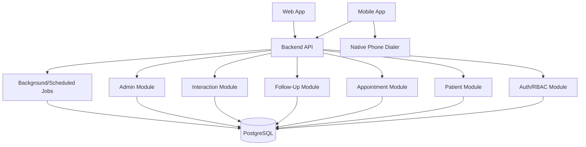

# SYSTEM_ARCHITECTURE.md — Dental Patient Follow-Up

> **Product boundary:** A focused CRM-lite system for **dental clinics and hospitals** that manages patient return appointments and follow-up continuity. It is not a traditional sales CRM, EMR/EHR, or full Hospital Management System (HMS).

> **Primary product reference:** *Patient Follow-Up App MVP Requirements*.

> **UX reference:** Zoho CRM Nextgen is used only for navigation and interaction patterns such as a unified/collapsible sidebar, a main work pane, global search/quick create, and contextual related-record history. Zoho's larger sales CRM feature set is intentionally excluded.

> **Notation:** **[ASSUMPTION]** marks a product/engineering decision introduced because the source requirements do not specify the detail.

## 1. Architectural Goal

Keep the MVP simple, secure, auditable, and easy to evolve.

Recommended shape: **modular monolith + relational database**, not microservices.

## 2. Logical Architecture



## 3. Reference Technology Stack

**[ASSUMPTION — replace with team standard if required]**

### Mobile
- Flutter

### Web
- Next.js / React

### Backend
- FastAPI, NestJS, or equivalent typed web API framework

### Database
- PostgreSQL

### Cache/Queue
- Not required initially.
- Redis can be added when background jobs, rate limiting, or scale justify it.

### Hosting
- Managed app runtime/container platform
- Managed PostgreSQL
- Object storage not required for MVP unless attachments are added later

## 4. Why Modular Monolith

The MVP has one tightly connected domain. Microservices would add:
- deployment complexity
- distributed transactions
- observability burden
- more failure modes

Use module boundaries inside one backend codebase so extraction remains possible later.

## 5. Backend Modules

```text
auth/
clinics/
users/
providers/
patients/
appointments/
followups/
interactions/
audit/
overview/
```

Each module owns:
- validation
- domain service
- repository/data access
- API routes
- authorization checks

## 6. Request Flow

```text
Client request
→ Authentication
→ Tenant resolution
→ RBAC authorization
→ Input validation
→ Domain service
→ Database transaction
→ Audit/domain rule
→ Response
```

## 7. Reschedule Transaction

Reschedule is a critical consistency boundary:

```text
BEGIN
Lock/check old appointment
Create replacement
Mark old SUPERSEDED
Link old/new
Complete old task
Create new task
Write audit
COMMIT
```

No client-side multi-request choreography should be responsible for this invariant.

## 8. Multi-Tenancy

**[ASSUMPTION]** Shared database, tenant-scoped rows for MVP.

Every tenant-owned table includes `clinic_id`.

Authorization always derives tenant from user session.

Future enterprise isolation can use separate schemas/databases if required.

## 9. Authentication

- Password hashing: Argon2id/bcrypt-quality implementation
- Short-lived access token
- Revocable refresh token/session
- Account disable support
- Login rate limiting

## 10. Auditability

Audit important actions:
- patient contact correction
- appointment create/update/void
- reschedule
- admin role/user change

Interactions themselves are business history and should be append-oriented.

## 11. Concurrency

Use optimistic locking (`row_version`) for appointment mutations.

Why: two receptionists/nurses may have the same patient open during shift overlap.

## 12. Background Jobs

MVP jobs may include:
- promote due retry tasks
- compute overdue status
- optional periodic operational counters

Avoid a separate workflow service initially.

## 13. Security Boundary

- HTTPS only
- server-side RBAC
- tenant isolation
- least privilege
- secrets outside source code
- encrypted managed database/storage
- structured audit logging
- no call recording

## 14. Observability

Minimum:
- structured application logs
- request ID
- error tracking
- health endpoint
- database metrics
- audit log

Do not log patient phone numbers or notes unnecessarily in application logs.

## 15. Deployment Environments

```text
local
staging
production
```

Separate databases and credentials.

## 16. Backup/Recovery

**[ASSUMPTION]**
- automated managed DB backups
- point-in-time recovery where available
- periodic restore test before production scale-up

## 17. Scalability Path

Scale in this order:
1. optimize indexes/queries
2. horizontal API replicas
3. cache high-frequency read models if needed
4. dedicated worker queue
5. only then consider service extraction

## 18. Architectural Non-Goals

- Microservices for MVP
- Event streaming platform
- Data warehouse
- ML platform
- Full HMS integration layer
- Telephony platform
