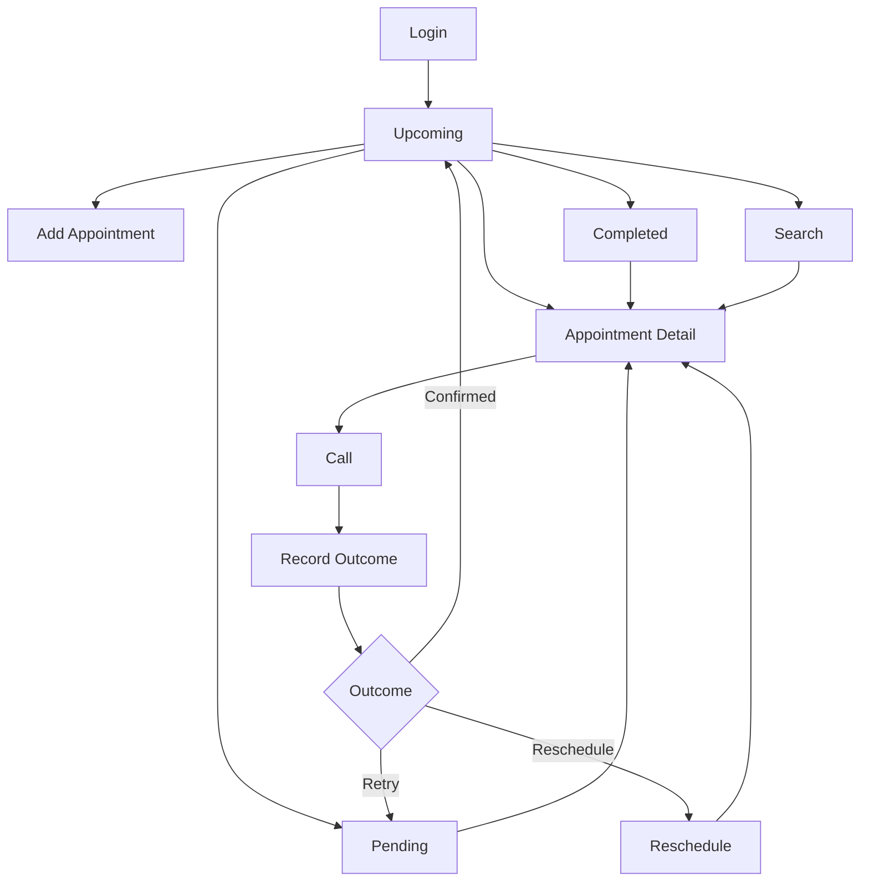
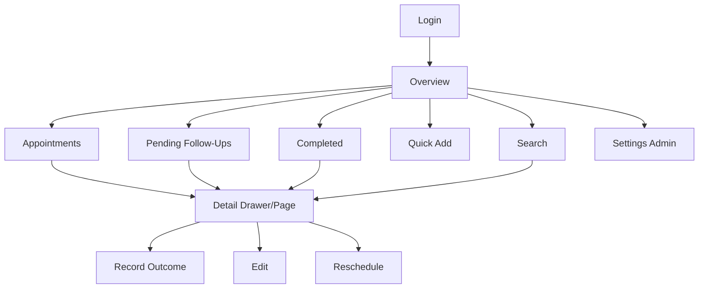

# WEB_FLOW.md — Dental Patient Follow-Up

> **Product boundary:** A focused CRM-lite system for **dental clinics and hospitals** that manages patient return appointments and follow-up continuity. It is not a traditional sales CRM, EMR/EHR, or full Hospital Management System (HMS).

> **Primary product reference:** *Patient Follow-Up App MVP Requirements*.

> **UX reference:** Zoho CRM Nextgen is used only for navigation and interaction patterns such as a unified/collapsible sidebar, a main work pane, global search/quick create, and contextual related-record history. Zoho's larger sales CRM feature set is intentionally excluded.

> **Notation:** **[ASSUMPTION]** marks a product/engineering decision introduced because the source requirements do not specify the detail.

## 1. Mobile Flow



## 2. Mobile Screens

### M01 Login
- Email
- Password

### M02 Upcoming
Default work screen:
- Today
- Tomorrow
- Later
- Appointment cards
- Search
- Add

### M03 Pending
- Not contacted
- No answer
- Busy
- Disconnected
- Call later
- Reschedule required
- Wrong number/blocked

### M04 Completed
- Confirmed
- Cancelled
- Superseded/rescheduled old records

### M05 Appointment Detail
- Patient
- Phone
- Date/time
- Dentist/doctor
- Reason
- Notes
- Status
- Call
- Edit
- Timeline

### M06 Add/Edit Appointment
Minimal form.

### M07 Outcome Sheet
Post-call response selection.

### M08 Reschedule
New date/time + optional note.

## 3. Desktop Flow



## 4. Desktop Routes

```text
/login
/overview
/appointments
/appointments/:id
/follow-ups/pending
/follow-ups/completed
/settings/users
/settings/providers
```

## 5. Role Landing

- Nurse: Upcoming/Pending
- Receptionist: Appointments/Pending
- Doctor: Overview
- Admin: Overview

## 6. Fastest Operational Path

```text
Open app
→ Upcoming/Pending
→ Patient
→ Call
→ Outcome
→ Next patient
```

Do not insert a generic CRM dashboard/module-selection step into this path.

## 7. Navigation Guards

- Unauthenticated → Login
- Disabled user → Access denied
- Wrong tenant record → Not found/forbidden without leaking existence
- Settings → Admin
- UI hides unavailable actions, but API performs final authorization
